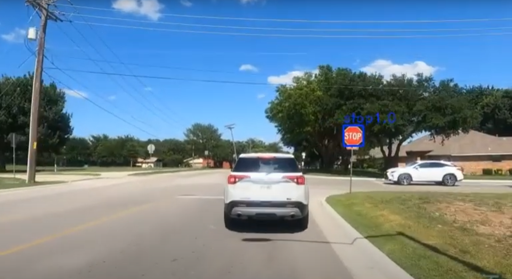

# Traffic Sign Detection with Faster RCNN Inception Resnet V2
Traffic Sign Detection system that utilizes Faster RCNN Inception Resnet V2. Complete steps on how to train the model can be found in train.ipynb. I used the tensorflow object detection repository to make the model. This also contains an application which can detect traffic signs in real time. Click the image below to see an example.

